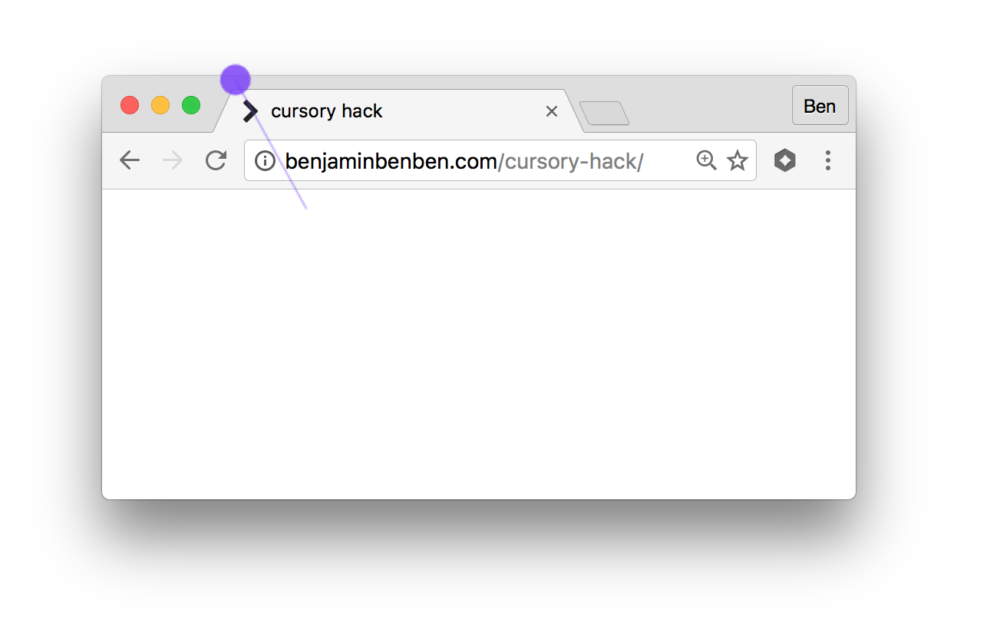

# cursory-hack

This is a hack that uses a custom cursor to draw outside of the browser window.

See [the live version]((https://benjaminbenben.com/cursory-hack/)).

This works using the following:
* you can set a custom css cursor up to 128x128px
* you can specify an alignment of that cursor (effectively letting you touch a 256x256px area)
* you can generate the cursor image dynamically using data-uris

https://jameshfisher.github.io/cursory-hack/
